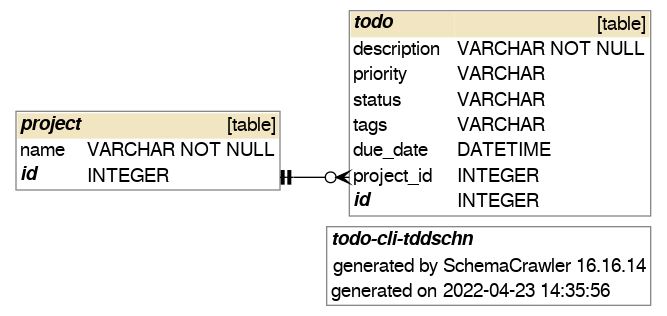
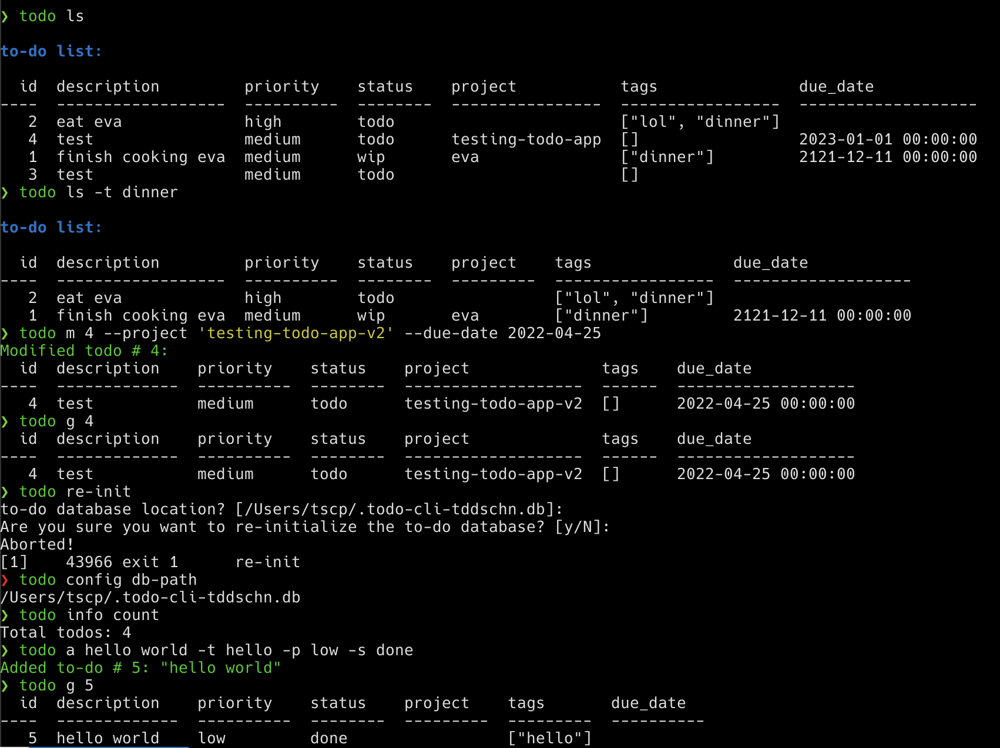
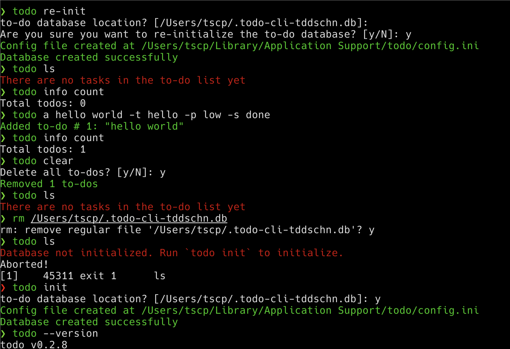
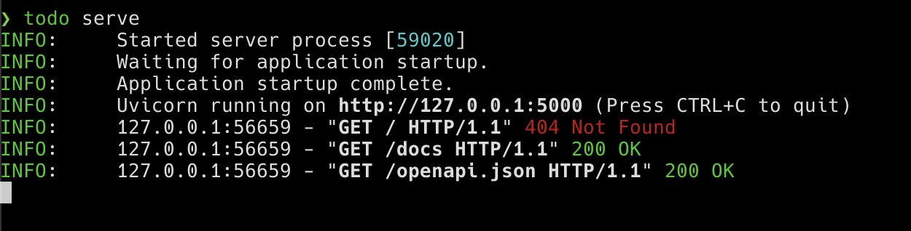
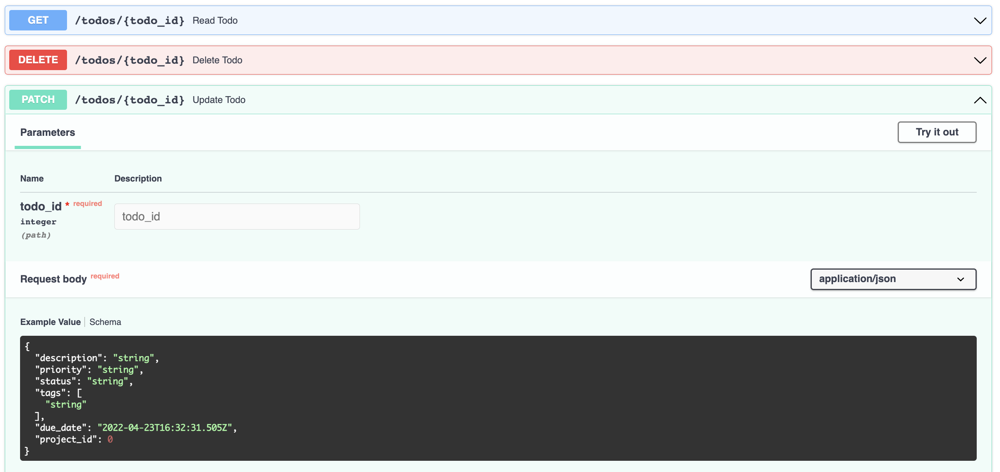

# todo-cli-tddschn

A simple command-line Todo app made with typer, sqlite and a REST API.

- [todo-cli-tddschn](#todo-cli-tddschn)
  - [Features](#features)
  - [Install](#install)
    - [pipx (recommended)](#pipx-recommended)
    - [pip](#pip)
  - [Usage](#usage)
    - [todo](#todo)
    - [todo ls](#todo-ls)
    - [todo serve](#todo-serve)
    - [todo config](#todo-config)
    - [todo info](#todo-info)
    - [todo utils](#todo-utils)
  - [Migrate to v1.0.0](#migrate-to-v100)
  - [Why do you made this?](#why-do-you-made-this)
  - [SQLite database schema](#sqlite-database-schema)
  - [Screenshots](#screenshots)

## Features
- Creating, reading, updating, and deleting todos;
- Nicely formatting the outputs (with color);
- `todo ls` lists all todos, ordered by priority and due date, the todos without a due date are put last (nullslast).
- Not only the command line interface - you can also CRUD your todos by making HTTP requests to the [REST API](#todo-serve).

## Install

### pipx (recommended)
```
pipx install todo-cli-tddschn
```

About [`pipx`](https://pypa.github.io/pipx)


### [pip](https://pypi.org/project/todo-cli-tddschn)
```
pip install todo-cli-tddschn
```

## Usage

### todo

You can add, modify, or remove (all) todos with the `todo` command:

```
todo --help

Usage: todo [OPTIONS] COMMAND [ARGS]...

  tddschn's command line todo app

Options:
  -v, --version         Show the application's version and exit.
  --install-completion  Install completion for the current shell.
  --show-completion     Show completion for the current shell, to copy it or
                        customize the installation.

  --help                Show this message and exit.

Commands:
  a        Add a new to-do with a DESCRIPTION.
  clear    Remove all to-dos.
  config   Getting and managing the config
  g        Get a to-do by ID.
  info     Get infos about todos
  init     Initialize the to-do database.
  ls       list all to-dos, ordered by priority and due date.
  m        Modify a to-do by setting it as done using its TODO_ID.
  re-init  Re-initialize the to-do database.
  rm       Remove a to-do using its TODO_ID.
```

### todo ls

List and filter the todos.

```
todo ls --help

Usage: todo ls [OPTIONS] COMMAND [ARGS]...

  list all to-dos, ordered by priority and due date.

Options:
  -d, --description TEXT
  -p, --priority [low|medium|high]
  -s, --status [todo|done|deleted|cancelled|wip]
  -pr, --project TEXT
  -t, --tags TEXT
  -dd, --due-date [%Y-%m-%d|%Y-%m-%dT%H:%M:%S|%Y-%m-%d %H:%M:%S]
  --help                          Show this message and exit.

Commands:
  project  Filter to-dos by project.
  tag      Filter to-dos by tag.
```

### todo serve

Serve the REST API (built with FastAPI)

```
todo serve --help
Usage: todo serve [OPTIONS]

  serve REST API. Go to /docs for interactive documentation on API usage.

Options:
  --host TEXT       [default: 127.0.0.1]
  --port INTEGER    [default: 5000]
  --log-level TEXT  [default: info]
  --help            Show this message and exit.
```

### todo config

Get or edit the configurations

```
todo config --help

Usage: todo config [OPTIONS] COMMAND [ARGS]...

  Getting and managing the config

Options:
  --help  Show this message and exit.

Commands:
  db-path  Get the path to the to-do database.
  edit     Edit the config file. # Opens in default editor
  path     Get the path to the config file.
```

### todo info

Get the info and stats about the todos.

```
todo info --help

Usage: todo info [OPTIONS] COMMAND [ARGS]...

  Get infos about todos

Options:
  --help  Show this message and exit.

Commands:
  count  Get todo counts
```

### todo utils

Utility commands.

```
todo utils --help
Usage: todo utils [OPTIONS] COMMAND [ARGS]...

Options:
  --help  Show this message and exit.

Commands:
  export                  Export todos to todo commands that can be used to re-construct your todo database
  fill-date-added-column  fill date_added column with the current time if it's null # used for migrate to v1.0.0
```

## Migrate to v1.0.0

`todo` v1.0.0 added a new column `date_added` to the `todo` table of the todo database,

and you need to migrate your todo database to v1.0.0 if you were using a previous version.

Here's the how:

- Install [alembic](https://alembic.sqlalchemy.org/en/latest/), the database migration tool.
  ```bash
  pip install alembic # or method of your choice
  ``` 

- Run the migration scripts in this repository and fill the new column with the current time:
  ```bash
  # clone this repository
  git clone https://github.com/tddschn/todo-cli-tddschn.git
  cd todo-cli-tddschn

  # migrate to new db schema
  python -m alembic revision --autogenerate -m "Initial Migration"
  python -m alembic upgrade head
  python -m alembic revision --autogenerate -m "Add date_added to Todo model"
  python -m alembic upgrade head

  # fill the new column (make sure to upgrade to v1.0.1 first)
  todo utils fill-date-added-column
  ```


## Why do you made this?

For practicing my python and SQL skills.

If you're looking for an awesome CLI todo app, try [taskwarrior](https://taskwarrior.org/).
## SQLite database schema



## Screenshots







